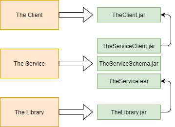
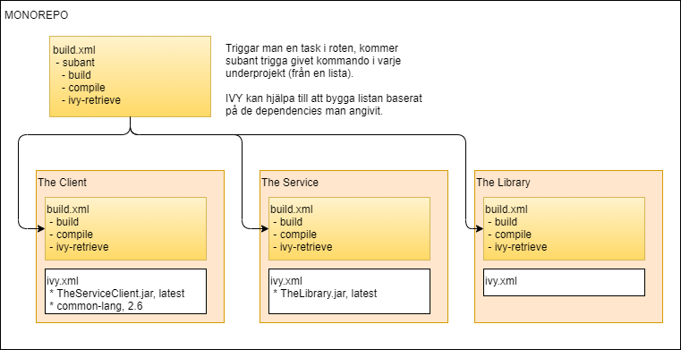
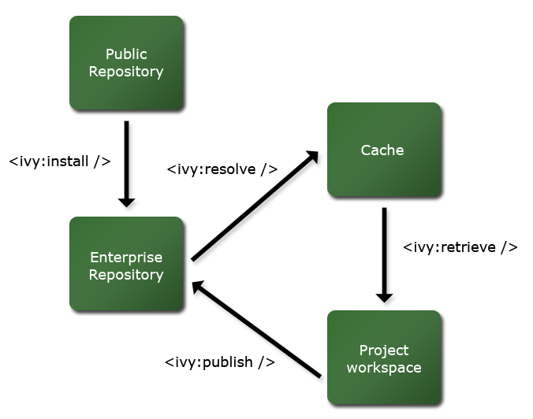
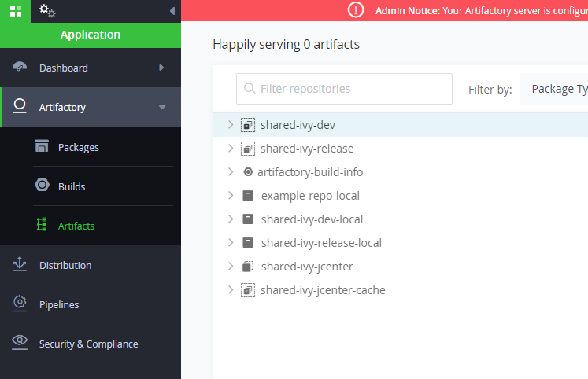
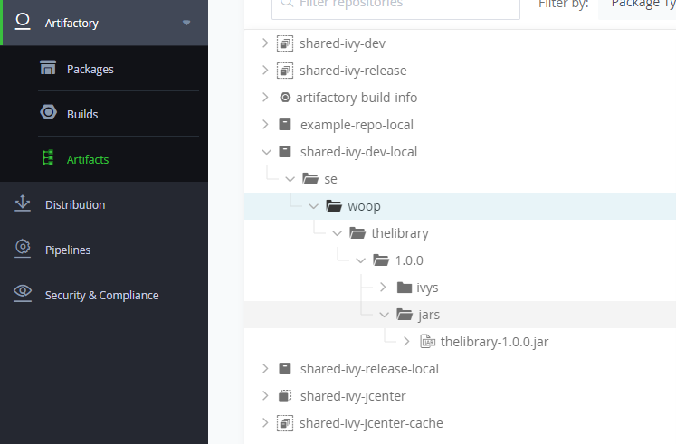

# ANT IVY MONOREPO EXEMPEL

För att testa det här repot behöver man ha Ant och Ivy installerat. Instruktioner för installation av Ant finns [här](https://ant.apache.org/manual/install.html).

När man har Ant installerat kan man gå in under foldern `install-ivy` och köra följande kommando för att installera Ivy:
```ant install-ivy```

## Projekt

I repot hittar vi tre project *TheService*, *TheClient* och *TheLibrary*. *TheService* producerar tre artifakter och *TheClient* och *TheLibrary* producerar en artifakt varderara. Bilden nedan visar hur  beroendena ser ut.

 

## Monorepo

Projekten ligger (som ni ser) samlade under ett repository, ett så kallat Monorepo. Med hjälp av Ant och en funktion som kallas *subant* kan vi med ett kommando i roten trigga ant targets i flera av de underliggande projekten. Ivy används för att hantera både externa och interna beroenden, vi kommer in på det mer under en rubrik längre ner.



För att bygga alla projekt kör följande kommando från roten:
```ant build```

För att rensa ett bygga kan man köra:
```ant clean```

## Ivy

Ivy är en extension till Ant som hanterar beroenden. När man installerat Ivy behöver man också lägga med följande i "project"-taggen i *build.xml*:

```xml
<project name="theprojectname" xmlns:ivy="antlib:org.apache.ivy.ant">
...
</project>
```

Detta ger ett antal nya targets som man kan använda för att trigga funktionalitet från Ivy. Nedanstående bild visar hur olika Ivy targets flyttar beroenden:

 

*Public Repository* motsvarar då Maven Central (eller motsvarande). *Enterprise Repository* motsvarar ett eget driftat artifactory (exempelvis JFrog). *Cache* ligger lokalt på din dator (normalt under .ivy2 i användarkatalogen). Det som inte syns i bilden är att man även kan göra en *Publish* till den lokala *Cachen* vilket är vad som görs för att hantera de interna beroendena under ett bygge. 

För att hämta in beroenden till ett projekt använder man alltså `<ivy:retrieve />` i *build.xml*. I bakgrunden gör `<ivy:retrieve>` också ett anrop till `<ivy:resolve>` för att synka de lokala artefakterna med vad som finns på det delade *repositoryt*. Nedan är ett exempel på hur det kan se ut i *build.xml*:

```xml
<target name="ivy-retrieve" description="Retrieve dependencies with ivy">
    <ivy:retrieve sync="true" type="jar,bundle,client,schema" pattern="lib/[artifact]-[type]-[revision].[ext]" />
</target>
```

*Sync* satt till true säkerställer att *lib* mappen med beroenden matchar det som är definierat i *ivy.xml*. Om inte *sync* skulle vara satt till *true* och man ändrar bland sina beroenden i *ivy.xml* skulle inte borttagna beroenden tas bort från *lib* mappen. *Type* definierar vilka artefakter som ska kopieras över, i det här exemplet pekar vi ut *jar*, *bundle*, *client* och *schema*. *Source* och *Javadoc* kommer bli ignorerade. *Pattern* definierar var beroendena ska kopieras och formatet på filnamnet för de kopierade beroendena.

### ivy.xml

Varje projekt som använder Ivy ska ha en *ivy.xml* i roten av projektet. I *ivy.xml* ligger information om projektet och dess artifakter samt en lista över vilka beroenden projektet har. 

Som exempel ser ivy.xml för *TheClient* ut såhär:

```xml
<ivy-module version="2.0"
    xmlns:xsi="http://www.w3.org/2001/XMLSchema-instance" xsi:noNamespaceSchemaLocation="http://ant.apache.org/ivy/schemas/ivy.xsd">

    <info organisation="se.woop" module="theclient" />

    <publications>
        <artifact name="theclient" type="jar" ext="jar" />
    </publications>

    <dependencies>
        <dependency org="commons-lang" name="commons-lang" rev="2.6" conf="*->default" />
        <dependency org="se.woop" name="theservice" rev="latest.integration" conf="*->client" />
    </dependencies>

</ivy-module>
```

Första taggen *info* innehåller info om projektet (modulen). Andra taggen *publications* innehåller information om de artefakter som publiceras från det här projektet. I exemplet ovan är det bara en, men det kan potentiellt vara flera. Tredje taggen *dependencies* innehåller en lista över de beroenden som projektet har. Både till interna projektberoenden som *common-lang* ovan och till interna projektberoenden som *theservice* ovan. 

Variabeln *rev* specificerar vilken version av beroendet man är intressera av. Till interna beroenden kan man använda *latest.integration* för att hela tiden få den senast byggda versionen av givet beroende.

Variabeln *conf* används för att specificera vilka transitiva beroenden man vill inkludera från beroendet. Om vi tar `*->client` som exempel så betyder det ungefär: *för alla typer av byggen är den här modulen beroende av alla transitiva beroenden av typen 'client'*. Det före pilen (`->`) specificerar för vilken eller vilka typer de specificerade typerna efter pilen gäller. Hade vi för beroendet till *theservice* ovan inte specificerat bara *client* hade vi även fått med två artefakter till för *service* och *schema*, eftersom *theservice* publicerar 3 olika artefakter.

Behöver man styra beroenden på en finare nivå än vad som är möjligt med *conf* finns två typer av barnelement man kan använda innanför *dependency* elementet, *include* och *exclude*. Dessa kan användas för att inkludera eller exkludera specifika transitiva beroenden. 

### ivysettings.xml

I *ivysettings.xml* finns information om olika källor för beroenden, så kallade *resolvers* samt i vilken ordning man ska anropa desamma. Ordningen specificeras i en så kallad *chain*. 

Utan att ha specificerat en egen *ivysettings.xml* kommer ivy använda sig av ett gäng standardinställningar. Information om hur dessa standardinställningar ser ut går att hitta [här](https://ant.apache.org/ivy/history/2.2.0/tutorial/defaultconf.html). För att överlagra dessa standardinställningar kan man ladda in en egen *ivysettings.xml* i sin *build.xml*. Detta görs genom att lägga in följande tagg:
`<ivy:settings file="../ivysettings/ivysettings.xml" />`

I det här projektet ser vår överlagrade *ivysettings.xml* ut såhär:

```xml
<ivysettings>
  <settings defaultResolver="default"/>
  <include url="${ivy.default.settings.dir}/ivysettings-public.xml"/>
  <include url="./ivysettings-shared.xml"/>
  <include url="${ivy.default.settings.dir}/ivysettings-local.xml"/>
  <include url="${ivy.default.settings.dir}/ivysettings-main-chain.xml"/>
  <include url="${ivy.default.settings.dir}/ivysettings-default-chain.xml"/>
</ivysettings>
```

Variabeln *ivy.default.settings.dir* pekar på foldern där default konfigurationerna finns (medpackade i ivy.jar normalt sett). I exemplet ovan har jag behållit alla default inställningar utom för *shared* resolvern. I samma folder som *ivysettings.xml* har jag skapat en *ivysettings-shared.xml*. 

Om man inte överlagrar kedjan för i vilken ordning man ska leta efter ett beroende är den som följer:

1. local
2. shared
3. public

*Local* pekar på foldern *local* i din lokala *.ivy2* katalog som ligger i din användarkatalog. I mitt fall följande sökväg: `C:\Users\davber100\.ivy2\local`.

Shared pekar normalt sett på foldern *shared* under din lokala *.ivy2* katalog. I vårt fall har vi överlagrat densamma för att peka på en artefakter istället. Vår *ivysettings-shared.xml* ser ut såhär:

```xml
<ivy-settings>
  <!--Authentication required for publishing (deployment). 'Artifactory Realm' is the realm used by Artifactory so don't change it.-->
  <credentials host="localhost" realm="Artifactory Realm" username="admin" passwd="SECRET PASSWORD HERE" />
  <resolvers>
    <url name="shared" m2compatible="true">
      <artifact pattern="http://localhost:8081/artifactory/example-ivy-dev-local/[organization]/[module]/[revision]/[type]s/[module](-[classifier])-[revision].[ext]" />
      <ivy pattern="http://localhost:8081/artifactory/example-ivy-dev-local/[organization]/[module]/[revision]/[type]s/ivy-[revision].xml" />
    </url>
  </resolvers>
</ivy-settings>
```

I exemplet ovan har jag pekat ut en artifactory som jag kör på min lokala maskin, men i praktiken borde den här vara en delad artifactory som alla utvecklare kan komma åt. 

Den sista resolvern *public* pekar på *ibiblio* som är en publik spegel av *mvncentral*. Den här skulle man kunna peka om mot ett repository som man hostar själv om man vill ha större kontroll över vilka beroenden som får lov att användas. 

## Sätt upp JFrog lokalt

Följande instruktion gäller Windows.

1. Börja med att ladda hem JFrog [här](https://releases.jfrog.io/artifactory/bintray-artifactory/org/artifactory/oss/jfrog-artifactory-oss/[RELEASE]/jfrog-artifactory-oss-[RELEASE]-windows.zip)
2. Packa upp nedladdad folder till önskat ställe på disk
3.  Gå in i foldern `.../app/bin`
4. Kör `artifactory.bat`
5. Gå till [http://localhost:8082/ui](http://localhost:8082/ui)
6. Logga in med användarnamn `admin` och lösenord `password`
7. Uppdatera admin lösenordet till `P4ssword`
8. Sätt "Base URL" till `http://localhost:8081`
9. "Skip" Default proxy
10. "Finish" och avsluta onboardingprocessen
11. Tryck på "Welcome, admin" uppe till höger, i menyn välj sedan "Quick Setup"
12. I popupen "Create Repositories" väljer du "Ivy"
13. I nästa i fyller du under "Repositories prefix" i "shared"
14. Klart!

Väljer du nu "Artifactory" och går till "Artifacts" i menyn till höger borde du se något i stil med dethär:



För att testa repositoryt kan du nu gå till det här projektet och in i *TheLibrary*. Kör sedan `ant build` följt av 
`ant ivy-publish-shared` för att publicera artefakten till repositoryt. Går du nu tillbaka och kollar under "Artifacts" och klickar upp "shared-ivy-dev-local" borde du se en ny publicerad artefakt:



Sådär ja, har du kommit såhär långt har du ett fungerande repository och kan publicera artefakter. Bra jobbat! :smiley:

 

